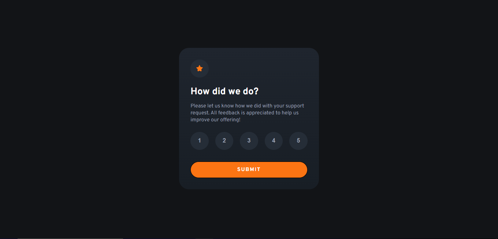

# Frontend Mentor - Interactive rating component solution

This is a solution to the [Interactive rating component challenge on Frontend Mentor](https://www.frontendmentor.io/challenges/interactive-rating-component-koxpeBUmI). Frontend Mentor challenges help you improve your coding skills by building realistic projects. 

## My experience
My first project using JavaScript. My first javascript code exceeded 80 lines and I realized that I could reduce the amount of lines. I did some research, asked ChatGPT and came up with this result.

It took me a while to finish the project, so my style.css might be a little messy because I kept forgetting the styles I put in.

# Screenshot
